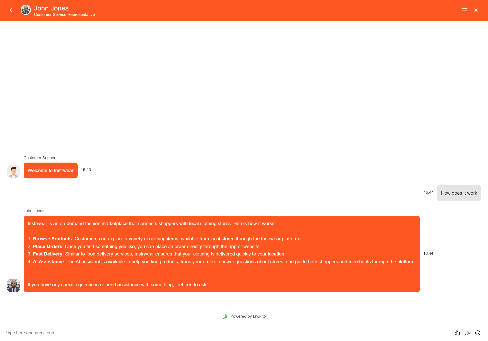

# InstrWear

## Overview

InstrWear is a full-stack Django web application that enables on-demand clothing delivery from local merchants. The platform allows users to browse, purchase, and receive clothing items efficiently through an integrated payment system powered by Stripe.

The application implements a multi-role architecture supporting both shoppers and merchants, and integrates third-party services to enhance user experience, including Stripe for payments and Tawk.to for AI-powered customer support.

---

## Project Objectives

- Develop a full-stack application using Django
- Implement role-based authentication (shopper and merchant)
- Integrate secure payment processing using Stripe
- Provide AI-powered customer support using Tawk.to
- Simulate a scalable marketplace platform

---

## User Experience (UX)

### User Goals

#### Shopper
- Register and log in securely
- Browse available products
- Complete purchases using Stripe
- Receive support via AI chat assistant

#### Merchant
- Register as a merchant
- Create and manage a business profile

---

## User Flow

### Shopper Journey

1. Visit landing page  
2. Register account  
3. Log in  
4. Browse products  
5. Select item  
6. Checkout  
7. Complete Stripe payment  
8. Receive confirmation  

### Merchant Journey

1. Register account  
2. Select merchant role  
3. Create business profile  
4. Manage account  

---

## Features

### Implemented Features

- Custom user model with role-based access
- Merchant profile system
- User authentication (register/login)
- Stripe payment integration
- AI-powered customer support (Tawk.to)
- Backend payment confirmation flow

---

### Future Features

- Real-time delivery tracking
- Merchant dashboard
- Product recommendation system

---

## Screenshots

### Landing Page

### Multi-Role Log-in Page

### Stripe Checkout

### Order Cart

### Order Confirmation

### AI Customer Support

---

## Database Design

---

## Technologies Used

- HTML5, CSS3, JavaScript  
- Python, Django  
- SQLite (development)  
- PostgreSQL (production via Heroku)  
- Stripe API  
- Tawk.to  

---

## Documentation

Detailed documentation can be found in the following files:

- [Design](DESIGN.md)
- [Testing](TESTING.md)
- [Deployment](DEPLOYMENT.md)
- [FAQ](FAQ.md)

---

## Credits

- Django Documentation  
- Stripe Documentation  
- Code Institute Learning Materials  

### Design Attribution

Design inspiration generated using prompts from:

https://www.designprompts.dev/

(Full prompt included in DESIGN.md)