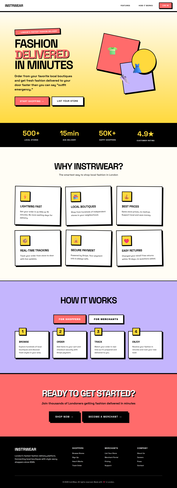
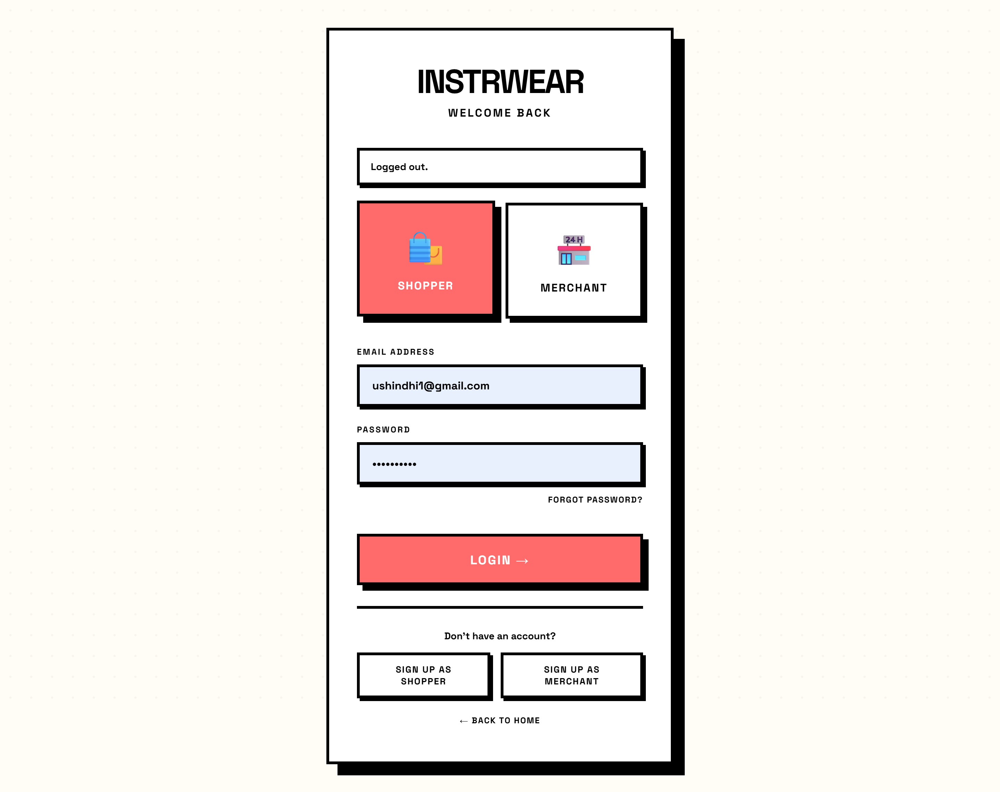
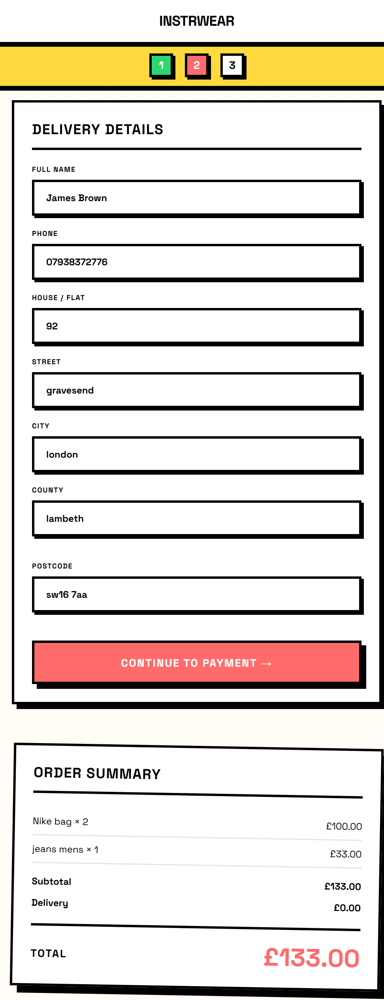
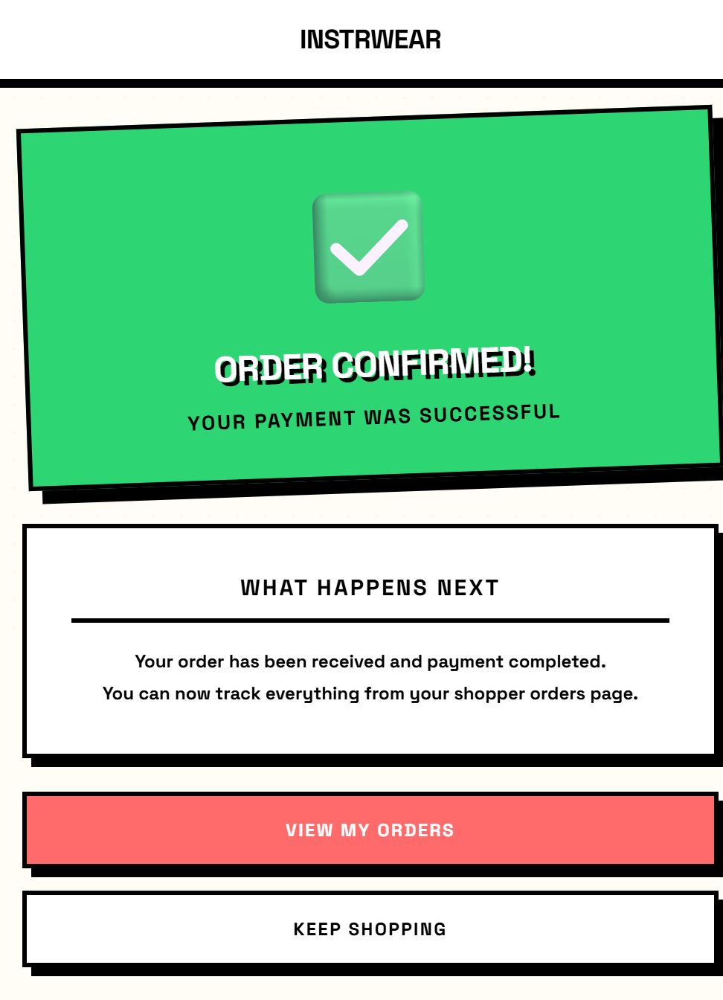
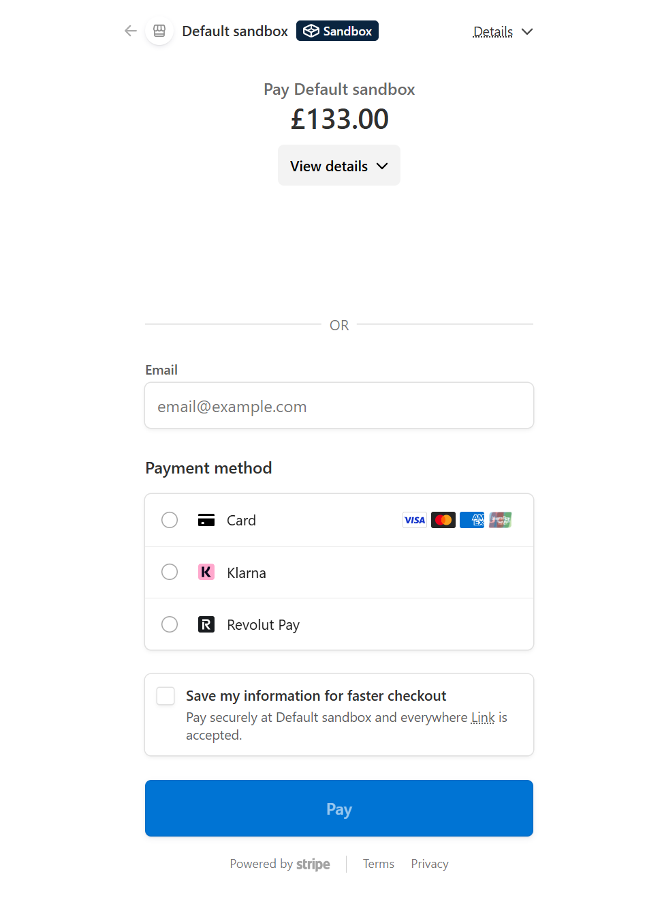

# InstrWear Documentation

## Overview

InstrWear is a full-stack Django web application that connects shoppers and merchants in a fashion marketplace.

This project is an MVP (Minimum Viable Product) designed to demonstrate:

- Full-stack development with Django
- Role-Based Access Control (RBAC)
- Structured onboarding flows
- Marketplace functionality (products, cart, checkout)

---

## Live Project

https://instrwear-8184ce115d49.herokuapp.com/

---

## Features

- User & merchant authentication
- Role-Based Access Control (RBAC)
- Onboarding flows for shoppers and merchants
- Product filtering by category (no search implemented)
- Product CRUD functionality (merchant)
- Shopping cart system
- Stripe checkout integration
- Order tracking
- Responsive, mobile-first UI

---

## Tech Stack

- Backend: Django (Python)
- Frontend: HTML, CSS, JavaScript
- Database (Development): SQLite
- Database (Production): PostgreSQL (Heroku)
- Design: Figma + DesignPrompt.dev

---

## Screenshots

---

## User & Merchant Flows

### Shopper Flow
1. Register account  
2. Login  
3. Complete onboarding  
4. Access dashboard  
5. Filter products by category  
6. Add items to cart  
7. Checkout via Stripe  

### Merchant Flow
1. Register account  
2. Complete onboarding  
3. Access merchant dashboard  
4. Add, edit, and manage products  

---

## Project Structure

- `accounts/` → authentication & user roles  
- `marketplace/` → products, cart, orders  
- `core/` → shared utilities & decorators  
- `templates/` → frontend templates  
- `static/` → CSS & JS  
- `media/` → uploaded images  
- `assets/screenshots/` → documentation images  
- `docs/` → project documentation  

---

## AI & Development Transparency

During development, I relied heavily on:

- GitHub Copilot  
- ChatGPT  
- Figma AI  
- DesignPrompt.dev (Neo-Brutalist template)  

All outputs were reviewed and implemented manually to ensure full understanding.

---

## Limitations (MVP)

- No search functionality (filters only)  
- No public API (Django views only)  
- Limited automated testing  
- Basic UI/UX in some areas  

---

## Future Improvements

- Add search functionality  
- Separate merchant public profiles  
- Courier/delivery system  
- Messaging system  
- Notifications  
- API with Django REST Framework  
- Performance optimisation